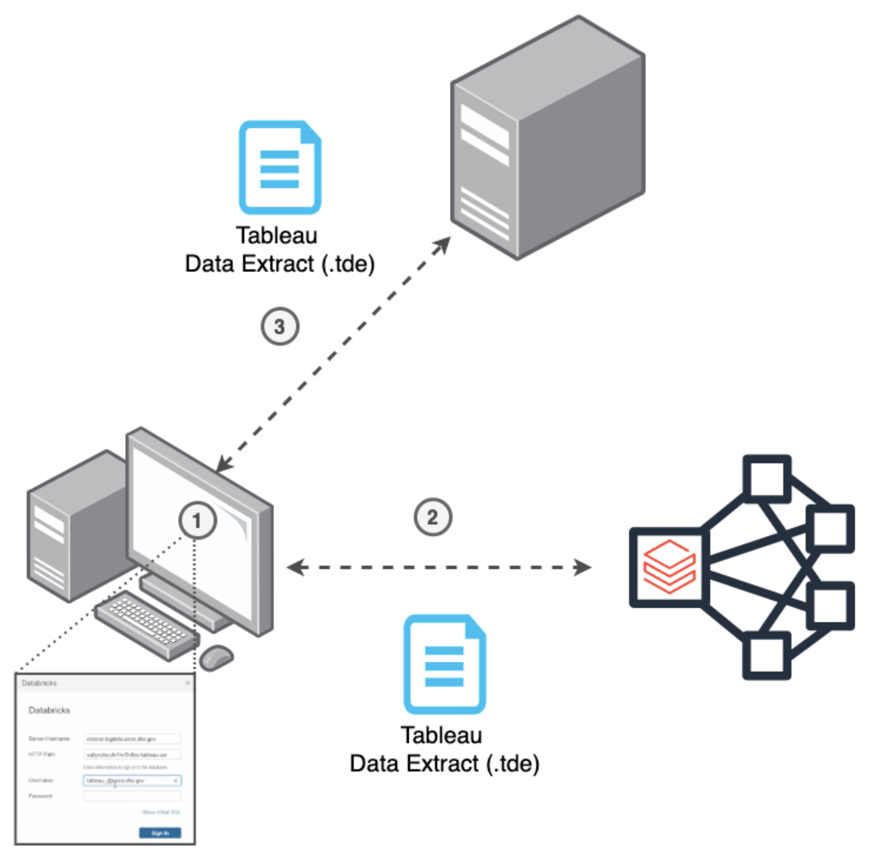

# hyperleaup
Pronounced "hyper-loop". Create and publish Tableau Hyper files from Apache Spark DataFrames or Spark SQL.

## Why are data extracts are _so slow_?
Tableau Data Extracts can take hours to create and publish to a Tableau Server.
Sometimes this means waiting around most of the day for the data extract to complete.
What a waste of time! In addition, the Tableau Backgrounder (the Tableau Server job scheduler)
becomes a single point of failure as more refresh jobs are scheduled and long running jobs exhaust the server’s resources.



## How hyperleaup helps
Rather than pulling data from the source over an ODBC connection, `hyperleaup` can write data directly to a Hyper file
and publish final Hyper files to a Tableau Server. Best of all, you can take advantage of all the benefits of 
Apache Spark + Tableau Hyper API:
- perform efficient CDC upserts
- distributed read/write/transformations from multiple sources
- execute SQL directly

`hyperleaup` allows you to create repeatable data extracts that can be scheduled to run on a repeated frequency
or even incorporate it as a final step in an ETL pipeline, e.g. refresh data extract with latest CDC.

## Example usage
The following code snippet creates a Tableau Hyper file from a Spark SQL statement and publishes it as a datasource to a Tableau Server.

```python
from hyperleaup import HyperFile

# Step 1: Create a Hyper File from Spark SQL
query = """
select *
  from transaction_history
 where action_date > '2015-01-01'
"""
hf = HyperFile("transaction_history", query)


# Step 2: Publish Hyper File to a Tableau Server
hf.publish(tableau_server_url,
           username,
           password,
           site_name,
           project_name,
           datasource_name)
```
